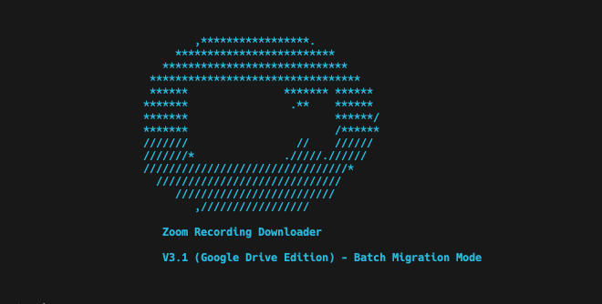

# ⚡️ zoom-recording-downloader ⚡️

## ☁️ Now with Google Drive support and a 3-Phase Migration Process ☁️

[](https://www.python.org/) [](https://raw.githubusercontent.com/betrybe/zoom-recording-downloader/refs/heads/download-from-file/LICENSE)

**Zoom Recording Downloader** is a cross-platform Python app that utilizes Zoom's API (v2) to download and organize all cloud recordings from a Zoom Business account to Google Drive.

This version is optimized for large-scale, resilient migrations using a CSV file as the source of truth, and it follows a safe, three-phase process: **Migrate**, **Verify**, and **Delete**.

## Screenshot



## Installation

*Attention: You will need [Python 3.11](https://www.python.org/downloads/) or greater*

```sh
git clone https://github.com/betrybe/zoom-recording-downloader
cd zoom-recording-downloader
git checkout download-from-file
pip3 install -r requirements.txt
```

The script can be run directly or by using the provided launcher script.

## Initial Setup

Before starting a migration, you need to configure your Zoom and Google Drive credentials.

### 1\. Zoom API Setup

You will need a [Zoom Developer account](https://marketplace.zoom.us/) to create a [Server-to-Server OAuth app](https://developers.zoom.us/docs/internal-apps) with the required credentials.

- **Create a Server-to-Server OAuth app:** Follow Zoom's [set up documentation](https://marketplace.zoom.us/docs/guides/build/server-to-server-oauth-app/) to get your `Account ID`, `Client ID`, and `Client Secret`.

- **Add Scopes:** In your app's *Scopes* tab, add the following scopes for the migration and verification process:
    > `cloud_recording:read:list_user_recordings:admin`, `user:read:user:admin`, `user:read:list_users:admin`

- **Add Deletion Scopes (for Phase 3):** To enable the deletion feature, add the following scopes:
    > `cloud_recording:delete:recording_file`, `cloud_recording:delete:recording_file:admin`

---

### 2\. Google Drive API Setup

- **Create a Google Cloud Project:** Go to the [Google Cloud Console](https://console.cloud.google.com) and enable the **Google Drive API**.

- **Create OAuth 2.0 Credentials:**

  - Go to "APIs & Services" \> "Credentials".

  - Click "Create Credentials" \> "OAuth client ID".

  - Choose "Desktop application" as the application type.

  - Download the JSON file and save it as `client_secrets.json` in the script's 
    directory.

- **Run Locally Once for Authentication:** Before running the script on a server, you must run it once on your local machine to perform the initial, interactive authentication with Google. This will generate a `token.json` file.

    ```bash
    ./zoom-recording-downloader.sh path/to/your/recordings.csv
    ```

- **Deploy to Server:** Upload `client_secrets.json` and `token.json` to your server along with the other script files.

---

### 3\. Configuration File (`zoom-recording-downloader.conf`)

Copy `zoom-recording-downloader.conf.template` to a new file named `zoom-recording-downloader.conf` and fill in your credentials.

## The 3-Phase Migration Process

This script is designed to migrate a large number of recordings safely. The process is broken down into three distinct phases.

## Phase 1: Migrate Recordings from Zoom to Google Drive

This phase downloads recordings from Zoom's cloud and uploads them to your Google Drive. It is designed to be run daily, processing recordings in batches to respect Google Drive's daily upload limits.

### How to Run Migration

Use the `zoom-recording-downloader.sh` launcher script, providing the path to a CSV file containing the list of recordings.

###### ⚠️ You can obtain a CSV with the recordings list by accessing the [recording management](https://www.zoom.us/recording/management) page on Zoom admin web interface and hitting the "Export" button.

```bash
# Run the migration script
./zoom-recording-downloader.sh path/to/your/zoomus_recordings.csv

# Dry run to see what would happen without actually downloading or uploading files
./zoom-recording-downloader.sh path/to/your/zoomus_recordings.csv --dry-run

# Run with a smaller batch size for testing (e.g., 50 GB)
./zoom-recording-downloader.sh path/to/your/zoomus_recordings.csv --batch-size-gb 50

# Combine dry run and batch size
./zoom-recording-downloader.sh path/to/your/zoomus_recordings.csv --dry-run --batch-size-gb 50
```

- The script uses a `progress_log.json` file to track the completion status of each individual file, allowing you to stop and resume the process at any time.

- On subsequent runs, it will automatically reset the daily batch counter and continue from where it left off.

- It is recommended to run this script daily until all recordings are migrated. The script will skip any recordings that have already been successfully migrated, ensuring that you do not duplicate uploads.

---

### Running the Migration

It is highly recommended to use a terminal multiplexer like `screen` or `tmux` to ensure the script continues to run even if your connection to the server is interrupted.

1. **Start a `screen` Session:**

    ```bash
    # Start a new session named 'migration'
    screen -S migration
    ```

2. **Execute the Script:** Run the script, providing the path to your recordings CSV file.

    ```bash
    ./zoom-recording-downloader.sh path/to/your/zoomus_recordings.csv
    ```

3. **Detach and Monitor:** You can safely detach from the `screen` session by pressing `Ctrl+A` followed by `D`. The script will continue running in the background. To re-attach to the session later and check the progress, use `screen -r migration`.

---

## Phase 2: Verify the Migration

After the migration phase is complete, you must run the verification script. This script audits the migration by comparing the files listed on Zoom for each recording session against the files that exist in your Google Drive.

### How to Run Verification

Use the `verify` command in the launcher script.

```bash
# Run the verification script
./zoom-recording-downloader.sh verify path/to/your/zoomus_recordings.csv

# Specify a custom name for the report
./zoom-recording-downloader.sh verify path/to/your/zoomus_recordings.csv --output-csv final_audit.csv
```

- This will produce a `verification_report.csv` file. This report contains all the original data plus new columns:
  - `zoom_file_count`: Number of downloadable files on Zoom.
  - `drive_file_count`: Number of files found in Google Drive.
  - `verification_status`: `COMPLETE`, `INCOMPLETE`, or `ERROR`.
  - `zoom_meeting_uuid`: The internal UUID needed for deletion.

**Review this report carefully. Do not proceed to the next phase until you are confident that all recordings are marked as `COMPLETE`.**

## Phase 3: Delete Recordings from Zoom Cloud

Once you have verified that all files have been successfully migrated, you can use this script to delete the recordings from Zoom's cloud storage, freeing up space.

⚠️ **This action is irreversible.** ⚠️

### How to Run Deletion

Use the `delete` command, providing the `verification_report.csv` generated in the previous phase.

```bash
# It is highly recommended to perform a dry run first
./zoom-recording-downloader.sh delete path/to/verification_report.csv --dry-run

# After confirming the dry run output, run the actual deletion
# You will be prompted for a final confirmation.
./zoom-recording-downloader.sh delete path/to/verification_report.csv

# Bypass the confirmation prompt (use with caution)
./zoom-recording-downloader.sh delete path/to/verification_report.csv --force
```

- This script will only attempt to delete recordings that are marked as `COMPLETE` in the verification report.

- It will produce a final `deletion_report.csv` detailing the outcome of each deletion attempt.
